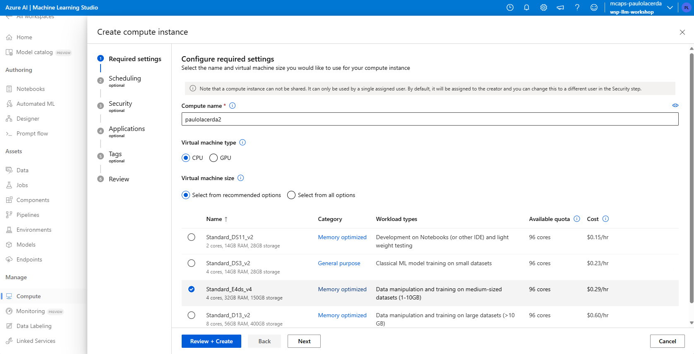
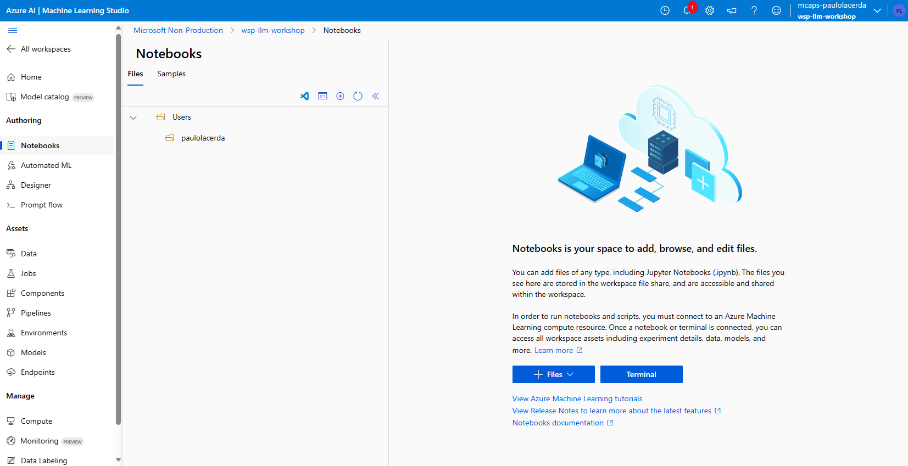
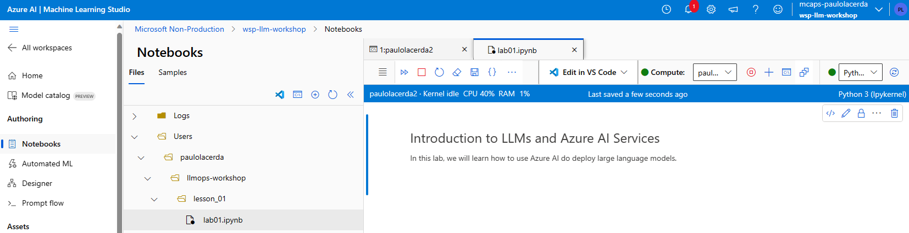

# LLMOps Workshop

Learn how to build solutions with Large Language Models
in a day. This includes learning Azure Machine Learning
Prompt Flow, Content Safety, Azure OpenAI, LLMs
solutions Evaluation and Monitoring.

## Contents

[Workshop contents](TOC.md)

## Requirements

<!-- - Workstation
    - [Azure CLI](https://learn.microsoft.com/en-us/cli/azure/install-azure-cli)
    - [Anaconda](https://docs.conda.io/projects/conda/en/latest/user-guide/install/index.html)
    - [VS Code](https://code.visualstudio.com/)
- Cloud -->

* [Github.com Account](https://github.com).
* GitHub as the source control repository.
* [Azure Subscription](https://azure.com).
<!-- 
* An Azure Machine Learning workspace.
## First Steps

1. Create an AzureML workspace in your subscription.

2. Open your workspace in AzureML Studio: [https://ml.azure.com/](https://ml.azure.com/)

3. In you AzureML workspace create a compute to use during the workshop.

    Compute > Compute Instances > New.
<p align="center">
  
</p>
    
4. Open terminal:
    
    Notebooks > Terminal
<p align="center">
  
</p>
    

5. Clone this repository.

```
    git clone https://github.com/placerda/llmops-workshop.git
```

6. **Done!** Now you can go to lesson 01 notebook.

<p align="center">
  
</p>  -->
