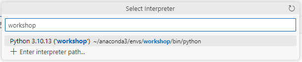

# LLMOps Workshop

Learn how to build solutions with Large Language Models 
in a day. This includes learning Azure Machine Learning
Prompt Flow, Content Safety, Azure OpenAI, LLMs 
solutions Evaluation and Monitoring.

## Requirements

- Workstation

    - [Anaconda](https://docs.conda.io/projects/conda/en/latest/user-guide/install/index.html)
    - [VS Code](https://code.visualstudio.com/)

- Cloud

    - [Azure Subscription](https://azure.com)
    - [Github.com Account](https://github.com)

## First Steps

1. Install the software listed in the previous section.
2. Clone this repository to your local workstation.
```
    git clone git@github.com:placerda/llmops-workshop.git
```
3. Open terminal to create and activate conda environment
```
conda create -n workshop python=3.10
```
4. Open the directory where the repository was cloned in terminal.
```
    cd llmops-workshop
```
5. Install the required python libraries.
```
    pip install -r requirements.txt
```
6. Add nbstripout filter to git to avoid saving notebooks output.
```
nbstripout --install
```
6. Open VS Code.
```
    code .
```
7. In VS Code select the conda environment you created in step 3.
```
Open the command palette by pressing Ctrl+Shift+P (or Cmd+Shift+P on macOS).
Type and select Python: Select Interpreter.
A list of discovered environments will be shown in the drop-down list. 
Select the Python environment named workspace.
```



8. Open the [first_steps/setup.ipynb](first_steps/setup.ipynb) notebook.
