#### Building LLMs Orchestration Flows

In this Lab we will learn how to build prompt flows to orchestrate you LLM App.

During this Lab we will go over the following steps:

1) Create a standard classification flow.
2) Create a conversational RAG flow.

#### Setup: Create a project in Azure AI Studio.

If you are running this Lab after lesson 1, you don't need to worry about this step, otherwise just execute step 1 of lesson 1 (Create a project in Azure AI Studio).

#### 1) Create a standard classification flow.

Go to your browser and type: https://ai.azure.com

Enter the Build menu and then select the Prompt flow option and click on the blue Create button.

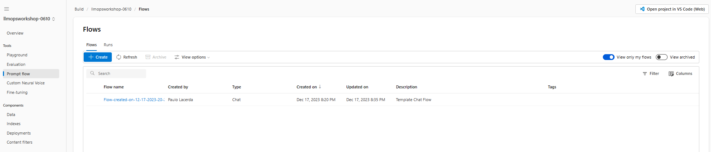

We will create a flow for classifying websites on the internet, so it will be a Standard flow.

In the flow creation window, select the **Standard flow** filter in the **Explore gallery** section and in the Web Classification box click on the Clone button.

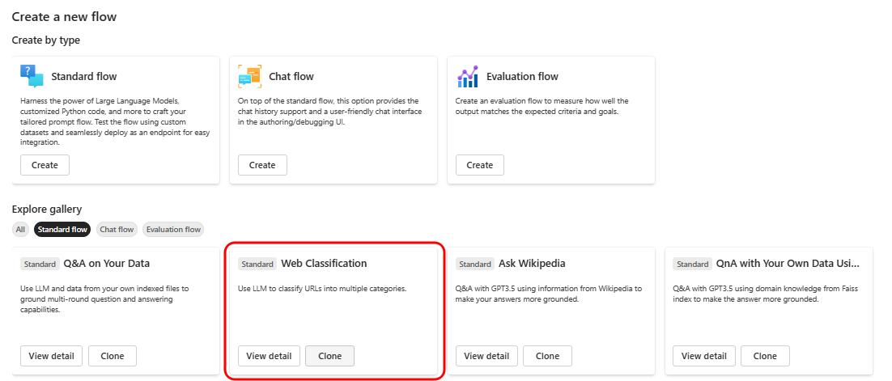

Use the default name for the flow, or if you prefer, define a name of your preference and click on Clone.

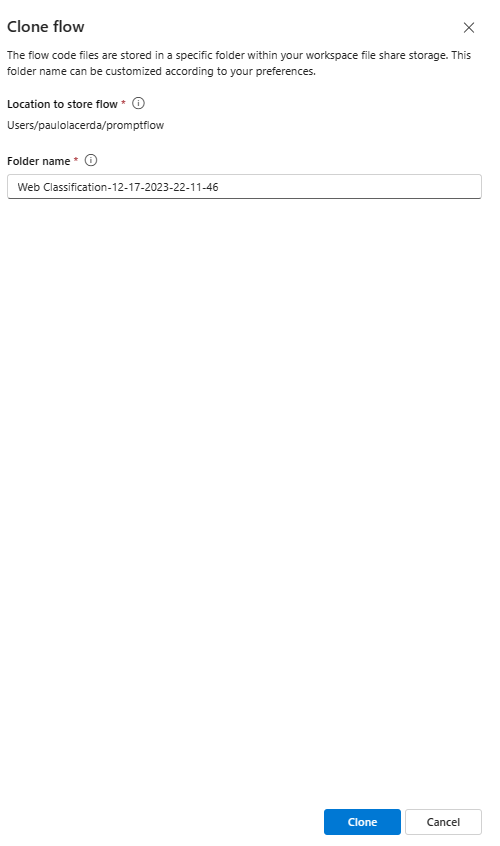

A Standard flow will be created with the following structure.

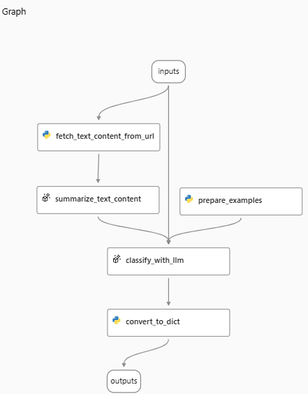

Notice that the flow has five nodes, the first fetch_text_content_from_url is a python node to extract the text from a Web page.

Then the content obtained by the extraction serves as input for an LLM node to summarize the content.

The summarization, combined with the classification examples generated by a python node (prepare_examples) is the input for another LLM node where the classification is performed.

At the end, we have a Python node responsible for formatting the output of the flow in a python dictionary format.

Now that the flow has been created, to run it in the Prompt Flow we need a runtime that combines the computational resource on which the flow will run and the environment that will be used.

If you have completed Lab 1, you don't need to worry about creating a Runtime, just select the one that was created previously, otherwise just follow the instructions for creating the runtime present in step 6 of Lab 1 and then select the runtime:

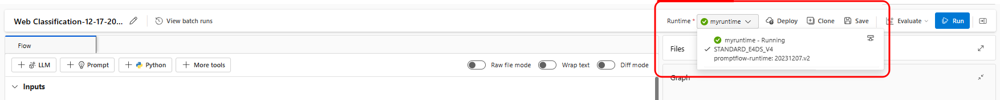

After selecting the Runtime, we have to define the Connection with the LLM at each LLM step, which in this case are summarize_text_content and classify_with_llm

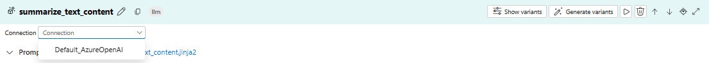

We are using the Default_AzureOpenAI Connection that connects with the Azure OpenAI resource created during the creation of the Azure AI project.

If you completed the lesson, you will have available in this resource a gpt-4 deployment to select, otherwise create a new deployment as described in step 2 of Lab 01.

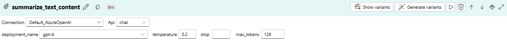

Associate the same Connection for the classify_with_llm step:

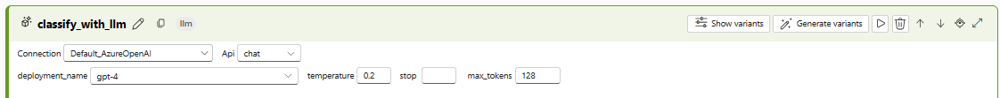

With the Runtime selected and the Connections already configured we can run the flow, for this just click on the Run button, located at the top of the page.

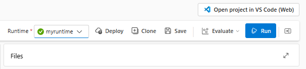

Notice that the input used in the execution is indicated in the input section of the flow.

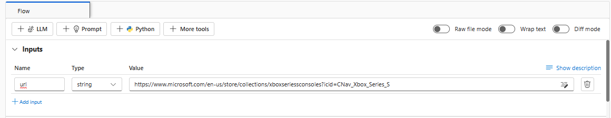

After finishing the execution you will see that the flow is complete with all steps.

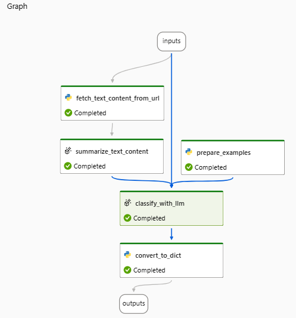

And the result of the processing can be seen in the last node.

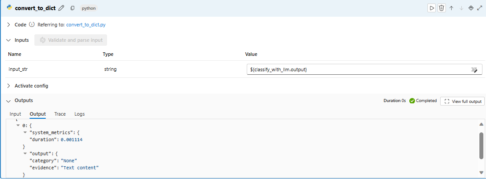

#### 2) Create a conversational RAG flow.

To create a conversational flow based on the RAG pattern, create a new flow in the Prompt Flow section within the Build area.

Select the Multi-Round Q&A on Your Data template.

A flow with this structure will be created.

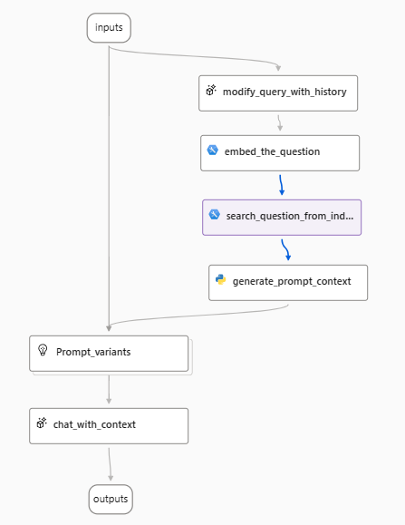.

The first node, modify_query_with_history, generates a search query based on the user's question and history.

In the second node, embed_the_question, we will convert the user's question into an embedding generated by the text-embedding-ada-002 model.

After generating the embedding, we use it to perform the search in a vector store in the search_question_from_indexed_docs step, this is when the retrieval of the RAG pattern is performed.

After the search step, the results are combined into a string that will compose the final prompt for the model to generate the answer for the user.

After creating the flow, it will be necessary to update the Connections of the nodes that connect with LLM models.

Starting with the embed_the_queston node, as we have not yet created a deployment for an embeddings model, it will be necessary to create it.

Click on the create deployment button on the node.

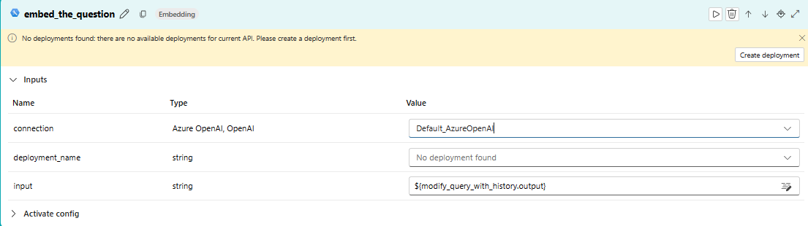

This click will take you to the deployment creation page, where you will select the text-embeddding-ada-002 deployment

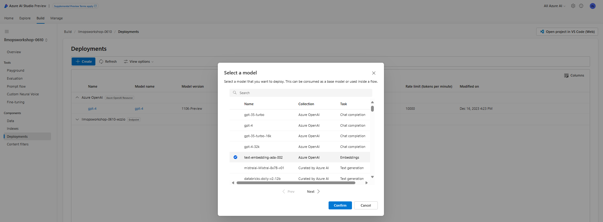

You can use the same name of the model in the deployment, as in the following figure:

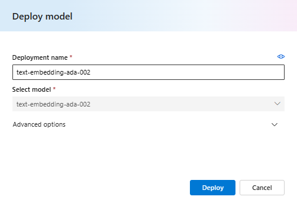

After creating the ADA deployment you will be able to select it in the embed_the_question node.

Then update the Connection in the modify_query_with_history node, as indicated below:

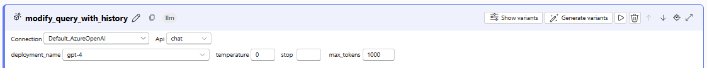

And the Connection for the chat_with_context node, as indicated below:

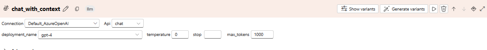

Now before running your flow, an important step is to create the search index for the Retrieval stage.

Create an instance of the Azure AI Search service, if you have not created it previously, for this it is very simple just go to the Azure Portal to search and create an instance of the AI Search service.

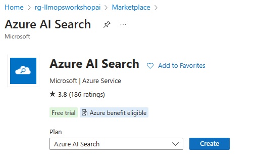

Now go back to the Playground, select your gpt-4 model and via the Add your data option create an index for your data.

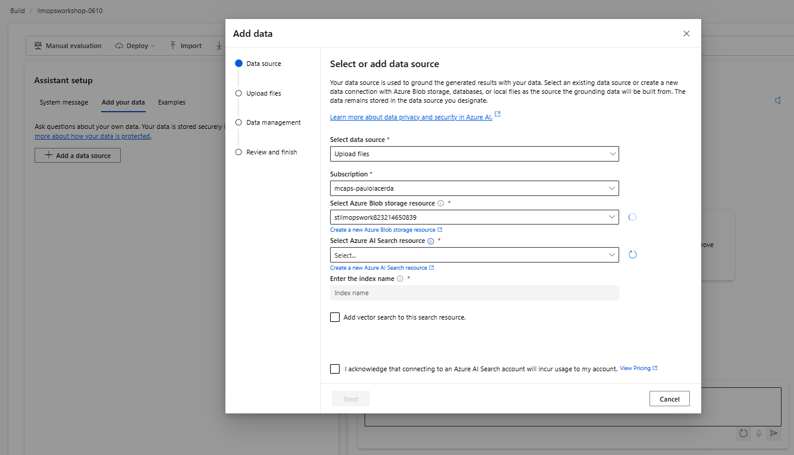

Access the Prompt Flow and delete the Index Lookup and add a Vector DB lookup to search in Azure AI Search instead of AzureML Vector Index.

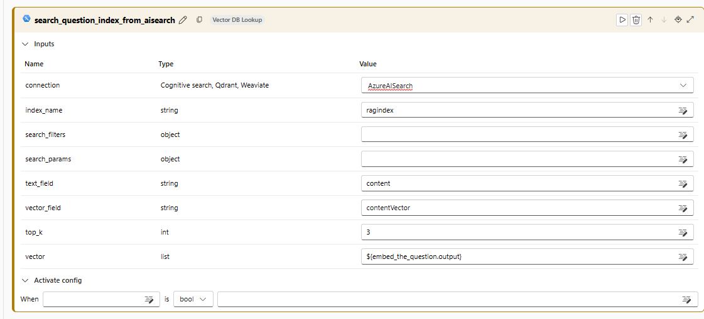

Now everything is ready for you to run your chat flow.

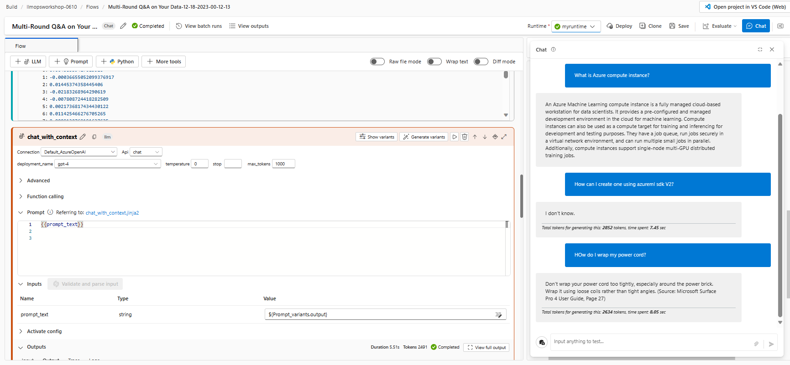
